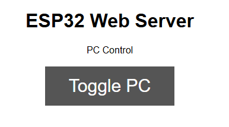

# ESP32 Remote Start

This is my personal project to turn my esp32 into a report start for my desktop PC. It is not super well documented (maybe I'll try to fix that in the future) but I wrote it a couple of months ago and I don't have the energy to properly do it now.

So, what the project does it host a wifi server on an ESP32 (picture below of the webpage) as well as forwarding physical power button presses to the PC. To be clear, you can turn the PC on by pressing the button on the website or by pressing the physical power button on the computer. Note this is a Platform.io project.



## Project Explanation 

In terms of hardware, I'm using an ESP32, a relay, and a few wires. As you might know, how the power button on a regular PC is by connecting two pins together (which triggers the PC to turn on). So I don't have to deal with properly connecting two circuit boards (my ESP32 and my motherboard), I'm using a relay (a circuit board that can programatically connect two wires together). When the ESP32 recieves the signal to toggle the PC, it connects the two pins on the PC by triggering the relay for 0.5 seconds. The pin that triggers the relay is pin 15 labeled `TOGGLE_PIN` in the code.

In terms of connecting the original power button on the PC, it's convenient that it is just a relay controlled by humans. What the code does is set one pin to 3.3 volts and another pin to detect that voltage. Those two pins are connected to the power button and when it is pressed, it connects the two pins and the signal is detected by the ESP32. For every instant the pins are connected, the code sends the signal to the relay to connect. The two pins I'm using for this are `BUTTON_INPUT` (pin 4) and `EXTRA_VCC` (pin 2) in the code.

## Setup

You will have to figure out the hardware setup from what I've told you. If you need to change the pins they are labeled well in the code under the section `Program Pins`.

Now, I don't actually deal with circuit boards that often so I didn't properly learn how to setup secrets (wifi password), so I just did it in a way that works, but is probably the wrong way to do it (C Preprocessor). If you download this repo you probably noticed that one of the files is missing, which is `env.h`. This is a header file I made to put my secrets in (wifi password) so it's not shared publicly on github. Of course for this project to work, you need it too, so here is the structure of the file (fill in your SSID and password):

src/env.h
```C
#ifndef __ENV__
#define __ENV__
#define ESP32_WIFI_SSID "put the name of your wifi here"
#define ESP32_WIFI_PASSWORD "Put your wifi password here"
#endif
```

Once you've made `src/env.h` and setup the hardware correctly (Maybe I'll make a diagram one day), you should be able to upload the code and it should work.

## Problems

When I was setting up the wiring I noticed that the Power Button sensing wires (when not fully connected and just dangling) seemed to trigger really easily. I'm guessing that if you plug in those two wires they sort of act like antennas. Maybe this could be fixed in code or using... a pull down resistor?, but the issue seems to be mostly resolved once the system is fully connected (the issue is exacerbated the longer the wires are, though).